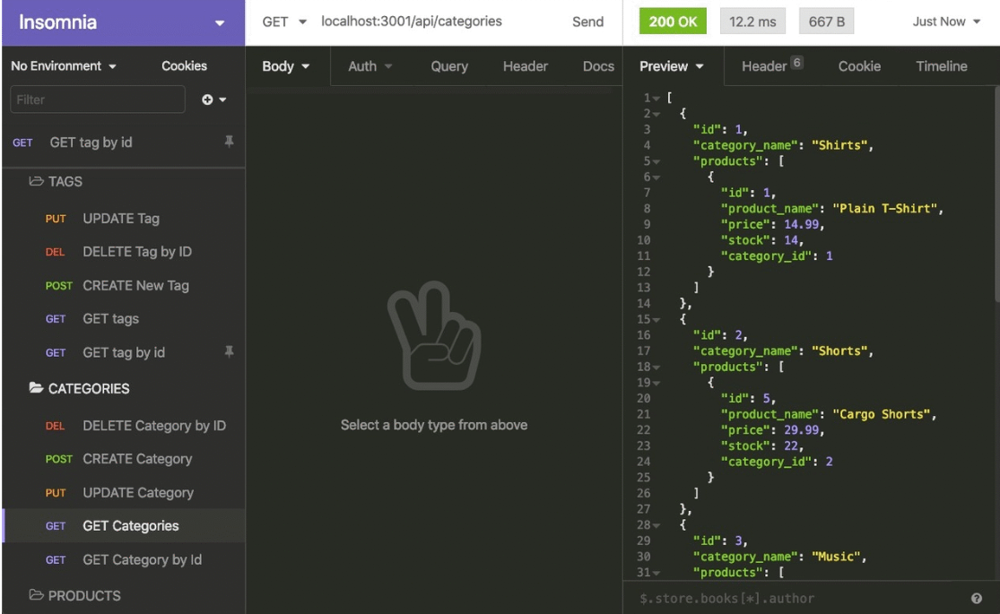

# ORM-e-commerce
  by allstarcoding777
  
  * ## Description
  This is a back-end application for an e-commerce site. I configured an Express.js API to use Sequelize to interact with a MySQL database.
  * ## Usage
  Open code in terminal. Type npm run start.
  
  
  
  * ## Demo
  Check out my demonstration of this app [HERE]()
  * ## Github Repository
  https://github.com/allstarcoding777/ORM-e-commerce
  * ## License
  This project is licensed under the MIT license.